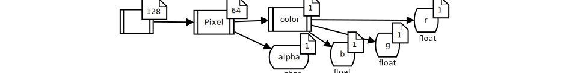

LLAMA – Low Level Abstraction of Memory Access
==============================================

Motivation
----------

We face the problem that different architectures these days perform best with
different memory access patterns, but as projects may last for decades while
new architectures rise and fall, it is dangerous to settle for one kind of
access. It is well-known that accessing complex data in a struct of array (SoA)
manner is most of the times faster than as array of structs (AoS):
```C++
// Array of Struct   |   // Struct of Array
struct               |   struct
{                    |   {
    float r, g, b;   |       float r[64][64], g[64][64], b[64][64];
    char a;          |       char a[64][64];
} image[64][64];     |   } image;
```

Even this very easy decision between SoA and AoS has quite different access
patterns, just compare `image[x][y].r` with `image.r[x][y]`. However for this
problem research and ready to use libraries already exist (e.g.
[SoAx](https://www.sciencedirect.com/science/article/pii/S0010465517303983) )

But there are more useful mappings than SoA and AoS such as blocking of
memory (like partly using SoA inside an AoS approach), strided access of data
(e.g. odd indexes after each other), padding and more.

Moreover often software is using a random mix of different heterogenous memory
regions of CPU, GPU, caches or network cards. A data layout optimized for a
specific CPU may be inefficient on a GPU or only slowly transferable over
network. So a mixed layout, not optimal for each part but the fastest trade-off,
may make sense. Again: This layout is highly dependent on the architecture, the
scaling of the problem and of course the chosen algorithm – and most probably
not trivially guessable.

Furthermore other third party libraries may expect specific memory layouts as
interface, which will most probably differ from library to library.

Challenges
----------

This results in these challenges LLAMA tries to address:

* Splitting of algorithmic view of data and the actual mapping in the background
  so that different layouts may be chosen **without touching the algorithm at
  all**.
* As it is well-known from C and C++ and because of this often the way
  programmers think of data, LLAMA shall *look* like AoS although the mapping
  will be different quite surely.
* To be compatible with as most architectures, softwares, compilers and third
  party libraries as possible, LLAMA is only using valid C++11 syntax. The
  whole description of the layout and the mapping is down with C++11 template
  programming (in contrast e.g. to fancy macro magic which is slow and hard to
  maintain).
* LLAMA shall be extensible in the sense of working together with new software
  but also memory layouts needed for new architectures.
* As it is the most easy way to write architecture independet but performant
  code, LLAMA should work well with auto vectorization approaches of modern
  compilers.

Concept
-------

To archieve these challenges LLAMA has a strict splitting of the "array" and
the "struct" part and to not mistakes these with the native C/C++ arrays and
structs, LLAMA defines

* the **user domain (UD)** as n-dimensional "array" with a **compile time
  dimension** but **run time size** per dimension and
* the **datum domain (DD)** as "struct" which is defined as a **compile time
  tree** (seen later).

To know how to map these both independent domains to memory, **mappings** are
defined. These mappings map a (run time) address in UD and a (compile time)
address in DD to byte addresses of potentially different memory regions
`UD` ⨯ `DD` → `memory region` ⨯ `byte address`. The mapping also defines how
much memory is needed, which can then be used to allocate it. The **allocator**
object is an important connection to other libraries such as
[Alpaka](https://github.com/ComputationalRadiationPhysics/alpaka) or
[DASH](https://github.com/dash-project/dash/) as LLAMA itself has no knowledge
about memory regions.

The **factory** takes the above-mentioned objects and creates a **view**, which
is a user accessable *container* of memory with the given attributes. It can be
used quite similar to C++ containers or C arrays of structs.


A definition of a datum domain looks like this
```C++
struct color {};
struct alpha {};
struct r {};
struct g {};
struct b {};

using namespace llama;

using Pixel = DatumStruct <
    DatumElement < color, DatumStruct <
        DatumElement < r, float >,
        DatumElement < g, float >,
        DatumElement < b, float >,
    > >,
    DatumElement < alpha, char >
>;
```

In pure C/C++ this may look like this
```C++
struct Pixel {
    struct {
        float r,g,b;
    } color;
    char alpha;
};
```

However it is not possible to iterate over struct members in C++11, so we need
to define the DD in the above-shown way. The naming of the members needs to be
predefined to detect the semantically same members in differend DDs. Furthermore
these namings can be encapsulated inside namespaces.

The defined DD tree would look like this:


The user domain is defined more easy like this
```C++
using UserDomain = llama::UserDomain< 2 >;
const UserDomain userDomain{ 64, 64 };
```

For an address in the user domain the view can return a **virtal datum** which
*feels* like an element in an n-dimensiona array but may still be distributed in
memory:
```C++
auto datum = view( { 23, 42 } );
```

With the compile time address in the datum domain, a definite memory access can
be done. All these access methods write the same value:
```C++
datum( color(), g() ) = 1.0f; //access with hierarichal dd namings
datum( llama::DatumCoord< 0, 1 >() ) = 1.0f; //access with dd tree coordinate
datum.access( color(), g() ) = 1.0f; //access with explicit access function
datum.access< color, g >() = 1.0f; //access with explicit template namings
datum.access< llama::DatumCoord< 0, 1 > >() = 1.0f; //same with tree coordinate
```

Furthermore virtual data can directly be changed without an address in the
datum domain accessing the whole domain like this
```C++
datum *= 5.0f;
datum1 += datum2;
```
where `datum1` and `datum2` don't need to have the same datum domain at all!
For every element in `datum1` also found in `datum2` (at compile time) the
`+=` operation is executed. If the DDs are without overlap, nothing happens at
all.

Working on Data
---------------

Per definition only the _complete_ user and datum domain coordinates are needed
for accessing the background data somewhere in the memory.
However as already stated it is possible to get intermediate types as accessors
for multiple data points in user and datum domain. The most basic type is the
`View`, followed by the `VirtualDatum` with fixed user domain and the element
in the very end:

`View ⟹ VirtualDatum ⟹ DataType`

However it also my make sense to work on a sub datum domain, e.g. for directly
manipulating only the `color` in the example above like this
`datum( color() ) = 0.0f` which only set the `r`, `g` and `b` but not the
`alpha` value. The same approach of partly fixed dimensions could be applied to
the `View` to get a smaller sub view or a slice. So the data access chain may
look like this in the future:

```
        ╔══════<═════╗                     ╔══════════<═════════╗
View ═╦═╩═> SubView ═╩═╦═> VirtualDatum ═╦═╩═> SubVirtualDatum ═╩═╦═> DataType
      ╚════════>═══════╝                 ╚════════════>═══════════╝
```

For easying copying between shifted views a new class `VirtualView` will be
created, which looks like a normal `View`, but has a potentially different size
or shifted origin. Not valid coords are ignored. It is very similar to the
`SubView` approach, but the `SubView` as true sub set of the `View` doesn't need
an extra range check. The data access chain changes like this:

```
        ╔══════════<═════════╗
        ║ ╔═> VirtualView ═╗ ║                     ╔══════════<═════════╗
View ═╦═╩═╩═══> SubView ═══╩═╩═╦═> VirtualDatum ═╦═╩═> SubVirtualDatum ═╩═╦═> DataType
      ╚════════════>═══════════╝                 ╚════════════>═══════════╝
```

Possible and planned assigments and assigments operations overloads
-------------------------------------------------------------------

As no lazy evalation / expression templates are implemented in llama (yet), only
operations directly changing the goal are possible without the need of a
temporary object. So `a += b` is possible, `c = a + b` is not as `a + b` would
be needed to be saved somewhere without changing `a` and `b`.

### Working

| Type | Possible operations |
| ---- | ------------------- |
| `VirtualDatum` | <ul><li>`=` and `<op>=`  (e.g. `+=` ) for any type, for which every element in the date domain has the assigment (operation) predefined or overloaded</li><li> `=` and `<op>=` `VirtualDatum` applying the assigment (operation) for every element in the (possibily different) date domains of the view with the same datum domain address.</li><li> `=` and `<op>=` `View`, which internally works like with `VirtualDatum` above for the very first datum in the view. Useful for direct assignment of temporary, one-element virtal data on the stack</li></ul> |

### Not implemented yet

| Type | Possible operations |
| ---- | ------------------- |
| `VirtualDatum` | <ul><li> `=` and `<op>=` `SubView` or `VirtualView` as same as with `View` in the table above.</li></ul>
| `View`, `SubView` or `VirtualView` | <ul><li>`=` and `<op>=`  (e.g. `+=` ) for any type, for which every element in the date domain has the assigment (operation) predefined or overloaded. Applies the operation on every element in the view.</li><li> `=` and `<op>=` `VirtualDatum` applying the assigment (operation) for every element in the (possibily different) date domains of the view with the same datum domain address for every element of the view.</li><li> `=` and `<op>=` `View`, `SubView` or `VirtualView` applies the assigment (operation) for every user datum coord valid in both views.</li></ul> |

Mapping description
-------------------
A mapping is a class providing basically two methods

* getting the total needed amount of memory regions and memory per region (in
  bytes) for a given DD and UD
* getting the memory region and byte position in it for a given DD and UD

Easy mappings like SoA or AoS are easily and fast written for this interface.
However padding, blocking, striding and the arbitrary combination of such
mappings is not possible. So we defined a special kind of mapping, the **tree
mapping**.

Tree mappings
-------------
As tree mapping is described by a **compile time tree** with **run time
annotations** on which **functors** are operated. These functors transform the
tree and offer a function for transforming coords from the old tree coord to a
coord of the new tree.

First the user and datum domain needs to be merged in such a tree. For the DD
this is straight forward as it is already a compile time tree. Only the run time
annotations need to be added:


The run time part of the tree indicates how often the node needs to be repeated.
For the DD this is 1. However for the UD the tree has only one child per node
but the run time a stated like this:


The fused tree `UD` ⨯ `DD` looks like this:



A tree coordinate now has only two elements per node level (except for the
last):

* the **run time** part which of the repetitions of the node shall be used
* the **compile time** part which of the child nodes shall be used

Different trees may now describe different mappings for the same user and datum
domain:

Array of Struct (no changes) | Padding | Struct of Array
---------------------------- | ------- | ---------------
 |  | 

The last tree is then flattend to the byte domain as seen here


<span style="font-size:200px">⟹</span>


More than one memory region is not supported by this mapping atm.

Third party compiler and library compatibility
----------------------------------------------

Although llama tries to abstract different compilers and libraries with C++11
metaprogramming some languages like CUDA use extensions which cannot directly
be mapped to C++, so for these macro hooks need to be provided. This is a well
known approach, e.g. also used by boost. When using CUDA, the include of llama
may look liks this:

```C++
#define LLAMA_FN_HOST_ACC_INLINE ALPAKA_FN_ACC \
	__host__ \
	__device__ \
	__forceinline__
#include <llama/llama.hpp>
```

The same approach can be used if alpaka is used, which itself abstracts the
CUDA extensions with macros.

```C++
#include <alpaka/alpaka.hpp>
#ifdef __CUDACC__
	#define LLAMA_FN_HOST_ACC_INLINE ALPAKA_FN_ACC __forceinline__
#else
	#define LLAMA_FN_HOST_ACC_INLINE ALPAKA_FN_ACC inline
#endif
#include <llama/llama.hpp>
```

Modern compilers are able to see "through" the layers of llama and figure out
when consecutive access in loops happens on consecutive data. However for
auto vectorization the data also needs to be independent which cannot expressed
directly with C++11. Many languages implement a `restrict` keyword for function
parameters, but this can also be used for pointers and thus is useless for
modern C++. Another option is to mark loops with `#pragma`s, like
`#pragma ivdep` for the intel compiler, that tell the compiler that every data
access inside the loop is independent. These `#pragma`s are abstracted by llama
in a macro way so that this code
```C++
LLAMA_INDEPENDENT_DATA
for ( auto pos = start; pos < end; ++pos )
	a( pos ) += b( pos );
```
can be auto vectorized for `gcc`, `clang`, `intel compiler`, `ibm xl` and so on. For not
yet supported compilers the definition does nothing. `gcc` and `clang` produce
vectorized code without such help anyway.

The interaction with memory of (other) third party libraries mostly happens with
allocators. Although the name suggests something else, the allocator can also be
used to "pass through" already existing memory. Of course the choice of the
right mapping fitting to the library is task of the user.

Something about deallocation
----------------------------
You may wonder when an how memory is deallocated. You get your view from the
factory, pass it around, but what happens to the allocated memory when the
context finishes?

This completely depends in the chosen allocator. The three (at the moment) built
in allocators are not working with plain pointers, but `std::shared_ptr`,
`std::vector` and the stack for fast allocation of small, temporary views. All
these keep track for moving, copying and getting out-of-scope.

However at least in the examples, more precisely the alpaka examples, three
new allocator types are defined. The `Alpaka` allocator works like the alpaka
buffer and therefore the same as `std` containers: If they are getting out of
scope, they are freed. However the `AlpakaMirror` and `AlpakaShared` allocators
are working on already existing pointers and not freed at any time. The
`AlpakaMirror` just extracts the native pointer from an alpaka buffer of an
`Alpaka` view to be able to pass it to a kernel (as alpaka buffers and therefore
views using the `Alpaka` allocator are host only). `AlpakaShared` manages the
alpaka given internal shared memory pointer, which is valid for the whole kernel
scope. You have to keep track on the memory yourself, but should in general try
to use automatically out-of-scope freeing allocators when possible.
