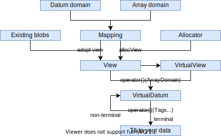

Introduction
============

Motivation
----------

Current hardware architectures are heterogeneous and it seems they will get even more heterogeneous in the future.
A central challenge of today's software development is portability between theses hardware architectures without leaving performance on the table.
This often requires separate code paths depending on the target system.
But even then, sometimes projects last for decades while new architectures rise and fall, making it is dangerous to settle for a specific data structure.

Performance portable parallelism to exhaust multi-, manycore and GPU hardware is addressed in recent developments like
`alpaka <https://github.com/alpaka-group/alpaka>`_ or
`Kokkos <https://github.com/kokkos/kokkos>`_.

However, efficient use of a system's memory and cache hierarchies is crucial as well and equally heterogeneous.
General solutions or frameworks seem not to exist yet.
First attempts are AoS/SoA container libraries like
`SoAx <https://www.sciencedirect.com/science/article/pii/S0010465517303983>`_ or 
`Intel's SDLT <https://software.intel.com/content/www/us/en/develop/documentation/cpp-compiler-developer-guide-and-reference/top/compiler-reference/libraries/introduction-to-the-simd-data-layout-templates.html>_`),
Kokkos's views or the proposed `std::mdspan <http://wg21.link/p0009r10>`_).

Let's consider an example.
It is well-known that accessing complex data in a struct of array (SoA) manner is most of the times faster than array of structs (AoS):

.. code-block:: C++

    // Array of Struct   |   // Struct of Array
    struct               |   struct
    {                    |   {
        float r, g, b;   |       float r[64][64], g[64][64], b[64][64];
        char a;          |       char a[64][64];
    } image[64][64];     |   } image;

Even this small decision between SoA and AoS has a quite different access style in code,
:cpp:`image[x][y].r` vs. :cpp:`image.r[x][y]`.
So the choice of layout already is usually quite infectious on the code we use to access a data structure.
For this specific example, research and ready to use libraries already exist.

But there are more useful mappings than SoA and AoS, such as:
 - blocking of memory (like partly using SoA inside an AoS approach)
 - strided access of data (e.g. odd indexes after each other)
 - padding
 - separating frequently accessed data from the rest
 - ...

Moreover, software is often using different heterogenous memory architectures such as RAM, VRAM, caches or network cards.
A data layout optimized for a specific CPU may be inefficient on a GPU or only slowly transferable over network.
A single layout -- not optimal for each architecture -- is very often a trade-off.
An optimal layout is highly dependent on the architecture, the scaling of the problem and of course the chosen algorithm.

Furthermore, third party libraries may expect specific memory layouts at their interface, into which custom data structures need to be converted.

Example use cases
-----------------

This library is designed and written at the `Helmholtz-Zentrum Dresden -- Rossendorf (HZDR) <https://www.hzdr.de>`_ by the
`group for computational radiation physics (CRP) <https://www.hzdr.de/crp>`_ and `CASUS <https://www.casus.science>`_.
While developing, we have some in house and partner applications in mind.
These example use cases are not the only targets of LLAMA, but drove the development and the feature set.

The CRP group works on a couple of simulation codes, e.g.
`PIConGPU <https://picongpu.hzdr.de>`_, the fastest particle in cell code
running on GPUs. Recent development efforts furthermore made the open source
project ready for other many core and even classic CPU multi core architectures
using the library alpaka. The similar
namings of alpaka and LLAMA are no coincidence. While alpaka abstracts the
parallelization of computations, LLAMA abstracts the memory access.
To get the best out of computational resources, accelerating data
structures and a mix of SoA and AoS known to perform well on GPUs is used.
The goal is to abstract these data structures with LLAMA to be able to change
them fast for different architectures.

Image processing is another big, emerging task of the group and partners. Both,
post processing of diffraction images as well as live analysis of high rate
data sources, will be needed in the near future. As with the simulation codes, the
computation devices, the image sensor data format and the problem size may vary
and a fast and easy adaption of the code is needed.

The shipped
`examples <https://github.com/alpaka-group/llama/tree/master/examples>`_
of LLAMA try to showcase the implemented feature in the intended usage.

Challenges
----------

LLAMA tries to address the following challenges:

* Splitting the view an algorithm has onto data and the actual mapping into memory
  so that different layouts may be chosen **without touching the algorithm at all**.
* LLAMA shall *look* like AoS although the mapping may be completely different.
  This keeps the access logic similar to the way programmers are used to in C++.
* To be compatible with many architectures, softwares, compilers and third
  party libraries, LLAMA tries to stay within C++17.
  The whole description of the layout and the mapping is done with C++17 template meta programming.
  No separate description files or language is used.
* LLAMA shall be extensible in the sense of working together with new software
  but also new memory layouts needed for emerging architectures.
* LLAMA should work well with auto vectorization approaches of modern compilers.

Library structure
-----------------

The library is split in mostly independent parts to ease the development and extensibility.
Many parts of LLAMA are active research and shall not interfere with orthogonal tasks of the library.

The most important data structure for the user is the :ref:`view <label-view>`
which holds the memory for the data and provides methods to access the data.

LLAMA wants to look as much as an array of struct approach as possible. To not
mix up C++ and LLAMA namings, the array-like domain is called
:ref:`Array domain <label-ad>` in LLAMA whereas the struct-like domain is called
:ref:`Datum domain <label-dd>`. More details about these domains follow in the
:ref:`next section <label-domains>`.

An access described in these domains is then mapped to a memory address by the view.
The mapping is done by a pluggable :ref:`mapping <label-mappings>`.
LLAMA comes with several predefined mappings, but users are free to create their own.
The memory underneath a view is provided by a customizable :ref:`allocator <label-allocators>`.
LLAMA again comes with a set of predefined allocators and users can again provider their own.
Alternatively, a view can also be created on top of an existing memory block.

The :cpp:`allocView()` takes all those user defined classes and creates the view out of their information.

