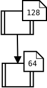
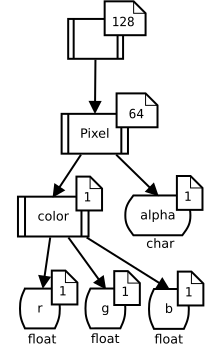
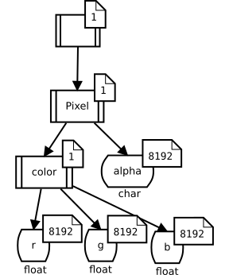
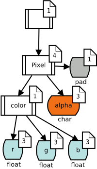
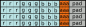

.. include:: common.rst

.. _label-mappings:

Mappings
========

One of the core tasks of LLAMA is to map an address from the array domain and
datum domain to some address in the allocated memory space.
This is particularly challenging if the compiler shall still be able to optimize the resulting
memory accesses (vectorization, reordering, aligned loads, etc.).
The compiler needs to **understand** the semantic of the mapping at compile time.
Otherwise the abstraction LLAMA provides will perform poorly.
Thus, mappings are compile time parameters to LLAMA's views.
LLAMA provides a manifold of such mappings and users are also free to write their own mappings.

.. image:: ../images/mapping.svg

Concept
-------

A LLAMA mapping is used to create views as detailed in the :ref:`allocView API section <label-api-allocView>` and views consult the mapping when resolving accesses.
The view requires each mapping to fulfill the following concept:

.. code-block:: C++

    template <typename M>
    concept Mapping = requires(M m) {
        typename M::ArrayDomain;
        typename M::DatumDomain;
        { M::blobCount } -> std::convertible_to<std::size_t>;
        llama::Array<int, M::blobCount>{}; // validates constexpr-ness
        { m.blobSize(std::size_t{}) } -> std::same_as<std::size_t>;
        { m.blobNrAndOffset(typename M::ArrayDomain{}) } -> std::same_as<NrAndOffset>;
    };

That is, each mapping type needs to expose the types :cpp:`M::ArrayDomain` and :cpp:`M::DatumDomain`.
Furthermore, each mapping needs to provide a static constexpr member variable :cpp:`blobCount` and two member functions.
:cpp:`blobSize(i)` gives the size in bytes of the :cpp:`i`\ th block of memory needed for this mapping.
:cpp:`i` is in the range of :cpp:`0` to :cpp:`blobCount - 1`.
:cpp:`blobNrAndOffset(ad)` implements the core mapping logic by translating a array domain coordinate :cpp:`ad` into a value of :cpp:`llama::NrAndOffset`, containing the blob number of offset within the blob where the value should be stored.

AoS mappings
------------

LLAMA provides a family of AoS (array of structs) mappings based on a generic implementation.
AoS mappings keep the data of a single datum close together and therefore maximize locality for accesses to an individual datum.
However, they do not vectorize well in practice.

.. code-block:: C++

    llama::mapping::AoS<ArrayDomain, DatumDomain> mapping{arrayDomainSize};
    llama::mapping::AoS<ArrayDomain, DatumDomain, true> mapping{arrayDomainSize}; // respect alignment
    llama::mapping::AoS<ArrayDomain, DatumDomain, true
        llama::mapping::LinearizeArrayDomainFortran> mapping{arrayDomainSize}; // respect alignment, column major

By default, the :cpp:`ArrayDomain` is linearized using :cpp:`llama::mapping::LinearizeArrayDomainCpp` and the layout is tightly packed.
LLAMA provides the aliases :cpp:`llama::mapping::AlignedAoS` and :cpp:`llama::mapping::PackedAoS` for convenience.

There is also a combined array of struct of arrays mapping,
but, since the mapping code is more complicated, compilers currently fail to auto vectorize view access:

.. code-block:: C++

    llama::mapping::AoSoA<ArrayDomain, DatumDomain, Lanes> mapping{arrayDomainSize};

.. _label-tree-mapping:

SoA mappings
------------

LLAMA provides a family of SoA (struct of arrays) mappings based on a generic implementation.
SoA mappings store the attributes of a datum contigiously and therefore maximize locality for accesses to the same attribute of multiple datums.
This layout auto vectorizes well in practice.

.. code-block:: C++

    llama::mapping::SoA<ArrayDomain, DatumDomain> mapping{arrayDomainSize};
    llama::mapping::SoA<ArrayDomain, DatumDomain, true> mapping{arrayDomainSize}; // separate blob for each attribute
    llama::mapping::SoA<ArrayDomain, DatumDomain, true,
        llama::mapping::LinearizeArrayDomainFortran> mapping{arrayDomainSize}; // separate blob for each attribute, column major

By default, the :cpp:`ArrayDomain` is linearized using :cpp:`llama::mapping::LinearizeArrayDomainCpp` and the layout is mapped into a single blob.
LLAMA provides the aliases :cpp:`llama::mapping::SingleBlobSoA` and :cpp:`llama::mapping::MultiBlobSoA` for convenience.

AoSoA mappings
--------------

There are also combined AoSoA (array of struct of arrays) mappings.
Since the mapping code is more complicated, compilers currently fail to auto vectorize view access.
We are working on this.
The AoSoA mapping has a mandatory additional parameter specifying the number of elements which are blocked in the inner array of AoSoA.

.. code-block:: C++

    llama::mapping::AoSoA<ArrayDomain, DatumDomain, 8> mapping{arrayDomainSize}; // inner array has 8 values
    llama::mapping::AoSoA<ArrayDomain, DatumDomain, 8,
        llama::mapping::LinearizeArrayDomainFortran> mapping{arrayDomainSize}; // inner array has 8 values, column major

By default, the :cpp:`ArrayDomain` is linearized using :cpp:`llama::mapping::LinearizeArrayDomainCpp`.

LLAMA also provides a helper :cpp:`llama::mapping::maxLanes` which can be used to determine the maximum vector lanes which can be used for a given datum domain and vector register size.
In this example, the inner array a size of N so even the largest type in the datum domain can fit N times into a vector register of 256bits size (e.g. AVX2).

.. code-block:: C++

    llama::mapping::AoSoA<ArrayDomain, DatumDomain,
        llama::mapping::maxLanes<DatumDomain, 256>> mapping{arrayDomainSize};

One mapping
-----------

The One mapping is intended to map all coordinates in the array domain onto the same memory location.
This is commonly used in  the `llama::One` virtual datum, but also offers interesting applications in conjunction with the `llama::mapping::Split` mapping.

Split mapping
-------------

WARNING: This is an experimental feature and might completely change in the future.

The Split mapping is a meta mapping in the sense, that it transforms the datum domain and delegates mapping to other mappings.
Using a datum coordinate, a subtree of the datum domain is selected and mapped using one mapping.
The remaining datum domain is mapped using a second mapping.

.. code-block:: C++

    llama::mapping::Split<ArrayDomain, DatumDomain,
        llama::DatumCoord<1>, llama::mapping::SoA, llama::mapping::PackedAoS>
            mapping{arrayDomainSize}; // maps the subtree at index 1 as SoA, the rest as packed AoS

Split mappings can be nested to map a datum domain into even fancier combinations.

.. _label-tree-mapping:

Tree mapping
------------------

WARNING: The tree mapping is currently not maintained and we consider deprecation.

The LLAMA tree mapping is one approach to archieve the goal of mixing different mapping approaches.
Furthermore, it tries to establish a general mapping description language and mapping definition framework.
Let's take the example datum domain from the :ref:`domain section<label-domains>`:

.. image:: ../images/layout_tree.svg

As already mentioned this is a compile time tree. The idea of the tree mapping
is now to extend this model to a compile time tree with run time annotations
representing the repetition of branches and to define tree operations which
create new trees out of the old ones while providing methods to translate tree
coordinates from one tree to another.

This is best demonstrated by an example. First of all the array domain needs to be
represented as such an tree too. Let's assume a array domain of
:math:`128 \times 64`:

The datum domain is already a tree, but as it has no run time influence, only
:math:`1` is annotated for these tree nodes:

.. image:: ../images/layout_tree_2.svg

Now the two trees are connected so that we can represent array domain and datum
domain with one tree:

The mapping works now in this way that the tree is "flattened" from left to
right using a breadth first traversal. Annotations represent repetitions of the node
branches. So for this tree we would copy the datum domain :math:`64` times and
:math:`128` times again -- basically this results in an array of struct
approach, which is most probably not desired.

So we want to transform the tree before flattening it. A struct of array
approach may look like this:

Struct of array but with a padding after each 1024 elements may look like this:

.. image:: ../images/padding_tree_2.svg

The size of the leaf type in "pad" of course needs to be determined based on the
desired aligment and sub tree sizes.

Such a tree (with smaller array domain for easier drawing) …

… may look like this mapped to memory:

In code a tree mapping is defined as :cpp:`llama::mapping::tree::Mapping`, but
takes one more template parameter for the type of a tuple of tree operations and
a further constructor parameter for the instantiation of this tuple.

.. code-block:: C++

    auto treeOperationList = llama::Tuple{
        llama::mapping::tree::functor::LeafOnlyRT()
    };

    using Mapping = llama::mapping::tree::Mapping<
        ArrayDomain,
        DatumDomain,
        decltype(treeOperationList)
    >;

    Mapping mapping(
        arrayDomainSize,
        treeOperationList
    );

    // or using CTAD and an unused argument for the datum domain:
    llama::mapping::tree::Mapping mapping(
        arrayDomainSize,
        llama::Tuple{
            llama::mapping::tree::functor::LeafOnlyRT()
        },
        DatumDomain{}
    );

The following tree operations are defined:

Idem
^^^^
:cpp:`llama::mapping::tree::functor::Idem` does not change the tree at all.
Basically a test functor for testing, how much the number of tree operations
has an influence on the run time.

LeafOnlyRT
^^^^^^^^^^^
:cpp:`llama::mapping::tree::functor::LeafOnlyRT` moves all run time parts of
the tree to the leaves, basically creates a struct of array as seen above.
However unlike :cpp:`llama::mapping::SoA` a combination with other mapping would
be possible.

MoveRTDown
^^^^^^^^^^
:cpp:`llama::mapping::tree::functor::MoveRTDown` moves a runtime multiplier from a node identified by a tree coordinate one level downward.
This effectively divides the annotation at the node by a given factor and multiplies the direct child nodes by this factor.

MoveRTDownFixed
^^^^^^^^^^^^^^^
Same as MoveRTDown but with a compile time factor.

Dump visualizations
-------------------

Sometimes it is hard to image how data will be laid out in memory by a mapping.
LLAMA can create a grafical representation of a mapping instance as SVG image or HTML document:

.. code-block:: C++

    #include <llama/DumpMapping.hpp>

    std::ofstream{filename + ".svg" } << llama::toSvg (mapping);
    std::ofstream{filename + ".html"} << llama::toHtml(mapping);

Since this feature is not often needed, it currently resides in a separate header :cpp:`llama/DumpMapping.hpp`
and is not included as part of :cpp:`llama.hpp`.
