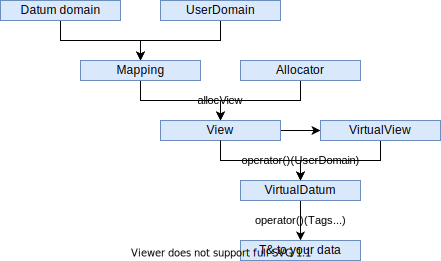

Concept
=======

Motivation
----------

We face the problem that different architectures these days perform best with
different memory access patterns, but as projects may last for decades while
new architectures rise and fall, it is dangerous to settle for one kind of
access. It is well-known that accessing complex data in a struct of array (SoA)
manner is most of the times faster than array of structs (AoS):

.. code-block:: C++

    // Array of Struct   |   // Struct of Array
    struct               |   struct
    {                    |   {
        float r, g, b;   |       float r[64][64], g[64][64], b[64][64];
        char a;          |       char a[64][64];
    } image[64][64];     |   } image;

Even this very easy decision between SoA and AoS has a quite different access
style in code, just compare :cpp:`image[x][y].r` with :cpp:`image.r[x][y]`.
However for this problem research and ready to use libraries already exist (e.g.
`SoAx <https://www.sciencedirect.com/science/article/pii/S0010465517303983>`_).

But there are more useful mappings than SoA and AoS such as blocking of
memory (like partly using SoA inside an AoS approach), strided access of data
(e.g. odd indexes after each other), padding and more.

Moreover often software is using a random mix of different heterogenous memory
regions of CPU, GPU, caches or network cards. A data layout optimized for a
specific CPU may be inefficient on a GPU or only slowly transferable over
network. So a mixed layout -- not optimal for each part -- may make sense as
trade-off between all memory regions. Again: This layout is highly dependent on
the architecture, the scaling of the problem and of course the chosen algorithm
-- and is most probably not trivially guessable.

Furthermore other third party libraries may expect specific memory layouts as
interface, which will most probably differ from library to library.

Example use cases
-----------------

The library is designed and written at the
`Helmholtz-Zentrum Dresden -- Rossendorf (HZDR) <https://www.hzdr.de>`_ inside
`the group for computational radiation physics (CRP) <https://www.hzdr.de/crp>`_
with some in house and partner applications in mind. These example use cases are
not the only targets of LLAMA, but drove the development and the feature set.

The CRP group works on a couple of simulation codes, e.g.
`PIConGPU <https://picongpu.hzdr.de>`_, the fastest particle in cell code
running on GPUs. Recent development efforts furthermore made the open source
project ready for other many core and even classic CPU multi core architectures
using the library
`alpaka <https://github.com/ComputationalRadiationPhysics/alpaka>`_. The similar
namings of alpaka and LLAMA are no coincidence. While alpaka abstracts the
parallelization of computations, LLAMA abstracts the memory access.
To bring the best out of the computational resources, accelerating data
structures and a mix out of SoA and AoS known to be performant on GPUs is used.
The goal is to abstract these data structures with LLAMA to be able to change
them fast for different architectures.

Image processing is another big, emerging task of the group and partners. Both
post processing of diffraction images as well as live analysis of high rate
data sources will be needed in the near future. As with the simulation codes the
computation devices, the image sensor data format and the problem size may vary
and a fast and easy adaption of the code is needed.

The shipped
`examples <https://github.com/ComputationalRadiationPhysics/llama/tree/master/examples>`_
of LLAMA try to show case the implemented feature in the intended usage.

Challenges
----------

This results in these challenges and goals LLAMA tries to address:

* Splitting the algorithmic view of data and the actual mapping in the background
  so that different layouts may be chosen **without touching the algorithm at
  all**.
* As it is well-known from C and C++ -- and often the way programmers think of
  data because of this -- LLAMA shall *look* like AoS although the mapping will
  be different quite surely.
* To be compatible with as most architectures, softwares, compilers and third
  party libraries as possible, LLAMA is only using valid C++17 syntax. The
  whole description of the layout and the mapping is done with C++17 template meta
  programming.
* LLAMA shall be extensible in the sense of working together with new software
  but also new memory layouts needed for emerging architectures.
* As it is the most easy way to write architecture independet but performant
  code, LLAMA should work well with auto vectorization approaches of modern
  compilers.

Library structure
-----------------

Therefore the library is split in as independent parts as possible to ease
the development and extensibility. Many parts of LLAMA are active research and
shall not interfere with orthogonal tasks of the library.

The most important data structure for the user is the
:ref:`view <label-view>` which holds the memory for the data and provides methods
to access the data.

LLAMA wants to look as much as an array of struct approach as possible. To not
mix up C++ and LLAMA namings, the array-like domain is called
:ref:`User domain <label-ud>` in LLAMA whereas the struct-like domain is called
:ref:`Datum domain <label-dd>`. More details about these domains follow in the
:ref:`next section <label-domains>`.

An access given in these domains is then mapped to a memory address by the view.
The mapping is done by a pluggable :ref:`mapping <label-mappings>`.
LLAMA comes with several predefined mappings, but users are free to create their own.
The memory underneath a view is provided by a customizable :ref:`allocator <label-allocators>`.
LLAMA again comes with a set of predefined allocators and users can again provider their own.
Alternatively, a view can also be created on top of an existing memory block.

The :cpp:`allocView()` takes all those user defined classes and creates the view out of their information.

