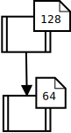
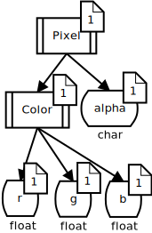
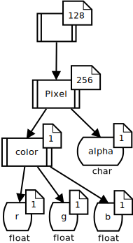
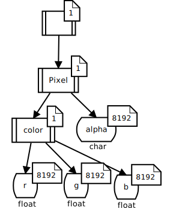
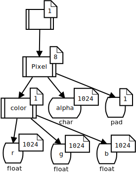
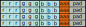

.. include:: common.rst

.. _label-mappings:

Mappings
========

One of the core tasks of LLAMA is to map an address from the user domain and
datum domain to some address in the allocated memory space.
This is particularly hard if the compiler shall still be able to optimize the resulting
memory accesses (vectorization, reodering, aligned loads, etc.).
The compiler needs to **understand** the semantic of the mapping at compile time.
Otherwise the abstraction LLAMA provides will perform poorly.

LLAMA mapping interface
-----------------------

The LLAMA mapping is used to create views as detailed in the :ref:`allocView API section <label-api-allocView>`.
Every mapping needs to fulfill the following concept:

.. code-block:: C++

    template <typename M>
    concept Mapping = requires(M m) {
        typename M::UserDomain;
        typename M::DatumDomain;
        { M::blobCount } -> std::convertible_to<std::size_t>;
        { m.getBlobSize(std::size_t{}) } -> std::convertible_to<std::size_t>;
        { m.getBlobNrAndOffset(typename M::UserDomain{}) } -> std::same_as<NrAndOffset>;
    };

That is, each Mapping type needs to expose the types :cpp:`M::UserDomain` and :cpp:`M::DatumDomain`.
Furthermore, each mapping needs to provide a static constexpr member variable :cpp:`blobCount` and two member functions.
:cpp:`getBlobSize(i)` gives the size in bytes of the :cpp:`i`th block of memory needed for this mapping.
:cpp:`i` is in the range of :cpp:`0` to :cpp:`blobCount - 1`.
:cpp:`getBlobNrAndOffset(ud)` implements the core mapping logic by translating a user domain coordinate :cpp:`ud` into a value of :cpp:`NrAndOffset`, containing the blob number of offset within the blob where the value should be stored.

It is possible to directly realize simple mappings such as array of struct,
struct of array or padding for this interface. However a connecting or mixing
of these mappings is not possible. To address this, mappings themself can define
some kind of mapping language themself which itself can archieve such goals.

Which approach of a mapping language is the best, is active research. The later
shown tree mapping is one attempt of an universal mapping language suitable for
many architectures. However even if it points out that this approach is not
working well, it is trivial to switch to a new mapping method without changing
the whole code as the mapping is independent of the other parts of LLAMA.

AoS and SoA mappings
--------------------

If only array of struct or struct of array is needed, LLAMA provides two
native mappings which show a good performance for all tested compilers (gcc,
clang, cuda, intel):

.. code-block:: C++

    llama::mapping::SoA

.. code-block:: C++

    llama::mapping::AoS

There is also a combined array of struct of arrays mapping, but, since the mapping code is more complicated, compilers currently fail to auto vectorize view access.

.. _label-tree-mapping:

LLAMA tree mapping
------------------

The LLAMA tree mapping is one approach to archieve the goal of mixing different mapping approaches.
Furthermore, it tries to establish a general mapping description language and mapping definition framework.
Let's take the example datum domain from the :ref:`domain section<label-domains>`:

.. image:: ../images/layout_tree.svg

As already mentioned this is a compile time tree. The idea of the tree mapping
is now to extend this model to a compile time tree with run time annotations
representing the repetition of branches and to define tree operations which
create new trees out of the old ones while providing methods to translate tree
coordinates from one tree to another.

This is best demonstrated by an example. First of all the user domain needs to be
represented as such an tree too. Let's assume a user domain of
:math:`128 \times 64`:

The datum domain is already a tree, but as it has no run time influence, only
:math:`1` is annotated for these tree nodes:

Now the two trees are connected so that we can represent user domain and datum
domain with one tree:

The mapping works now in this way that the tree is "flattened" from left to
right using a breadth first traversal. Annotations represent repetitions of the node
branches. So for this tree we would copy the datum domain :math:`64` times and
:math:`128` times again -- basically this results in an array of struct
approach, which is most probably not desired.

So we want to transform the tree before flattening it. A struct of array
approach may look like this:

Struct of array but with a padding after each 1024 elements may look like this:

The size of the leaf type in "pad" of course needs to be determined based on the
desired aligment and sub tree sizes.

Such a tree (with smaller user domain for easier drawing) …

.. image:: ../images/example_tree.svg

… may look like this mapped to memory:

In code a tree mapping is defined as :cpp:`llama::mapping::tree::Mapping`, but
takes one more template parameter for the type of a tuple of tree operations and
a further constructor parameter for the instantiation of this tuple.

.. code-block:: C++

    auto treeOperationList = llama::Tuple{
        llama::mapping::tree::functor::LeafOnlyRT()
    };

    using Mapping = llama::mapping::tree::Mapping<
        UserDomain,
        DatumDomain,
        decltype(treeOperationList)
    >;

    Mapping mapping(
        userDomainSize,
        treeOperationList
    );

The following tree operations are defined:

Idem
^^^^
:cpp:`llama::mapping::tree::functor::Idem` does not change the tree at all.
Basically a test functor for testing, how much the number of tree operations
has an influence on the run time.

LeafOnlyRT
^^^^^^^^^^^
:cpp:`llama::mapping::tree::functor::LeafOnlyRT` moves all run time parts of
the tree to the leaves, basically creates a struct of array as seen above.
However unlike :cpp:`llama::mapping::SoA` a combination with other mapping would
be possible.

MoveRTDown
^^^^^^^^^^
:cpp:`llama::mapping::tree::functor::MoveRTDown` moves a runtime multiplier from a node identified by a tree coordinate one level downward.
This effectively divides the annotation at the node by a given factor and multiplies the direct child nodes by this factor.

MoveRTDownFixed
^^^^^^^^^^^^^^^
Same as MoveRTDown but with a compile time factor.

Dump visualizations
-------------------

Sometimes it is hard to image how data will be laid out in memory by a mapping.
LLAMA can create a grafical representation of a mapping instance as SVG image or HTML document:

.. code-block:: C++

    #include <llama/DumpMapping.hpp>

    std::ofstream{filename + ".svg" } << llama::toSvg (mapping);
    std::ofstream{filename + ".html"} << llama::toHtml(mapping);

Since this feature is not often needed, it currently resides in a separate header :cpp:`llama/DumpMapping.hpp`
and is not included as part of :cpp:`llama.hpp`.
